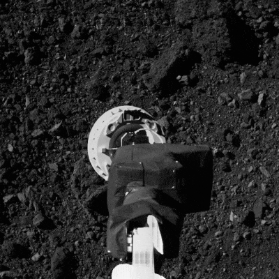
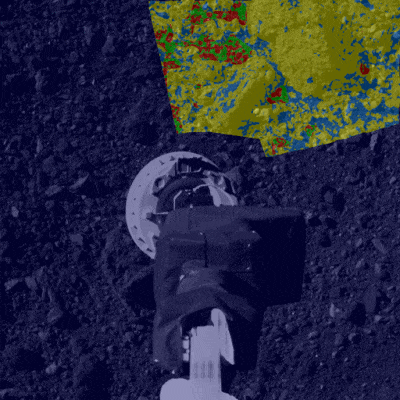

# Deep Monocular Hazard Detection for Safe Small Body Landing

Official repository for _Deep Monocular Hazard Detection for Small Body Landing_ (AAS 23-294) presented at the 2023 AAS/AIAA Space Flight Mechanics Meeting by Travis Driver, Kento Tomita, Koki Ho, and Panagiotis Tsiotras.

<p>
  
  
  <p>*Green, yellow, blue, and red labels represent true safe, true unsafe, false unsafe, and false safe, respectively.</p>
</p>


If you utilize our models or data, please cite

```
@inproceedings{drivertomita2023dmhd,
  title={Deep Monocular Hazard Detection for Small Body Landing},
  author={{Driver, Travis*} and {Tomita, Kento*} and Ho, Koki and Tsiotras, Panagiotis},
  booktitle={AAS/AIAA Space Flight Mechanics Meeting},
  pages={1-17},
  note={*These authors contributed equally to this work},
  year={2023}
}
```

If you use our data products, please also cite

```
@article{driver2022astrovision,
  title={AstroVision: Towards Autonomous Feature Detection and Description for Missions to Small Bodies Using Deep Learning},
  author={Driver, Travis and Skinner, Katherine and Dor, Mehregan and Tsiotras, Panagiotis},
  journal={preprint},
  note={arXiv:2208.02053},
  year={2022}
}
```

## Getting Started
